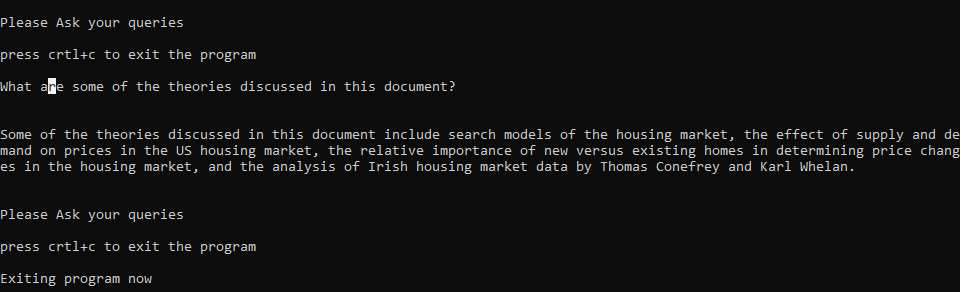

# Chat-bot

## Chat-Gpt based question answering bot
A command line-based chatbot leveraging OpenAI's language model for document summarization. The chatbot is designed to provide concise and coherent summaries of input documents, enhancing accessibility and information retrieval.

### More about Application
I spearheaded the development of an advanced command line-based chatbot, leveraging the LangChain library and seamlessly integrating OpenAI's language model to tackle the intricate challenge of document summarization. This innovative solution is powered by LangChain's sophisticated language processing capabilities, enabling the chatbot to efficiently analyze and comprehend complex textual structures. The integration with OpenAI's language model enhances the chatbot's natural language understanding, enabling it to generate concise and coherent summaries of input documents.

The chatbot employs a modular architecture that facilitates easy integration with different language models, ensuring scalability and adaptability for future advancements. The implementation involves asynchronous programming to optimize performance, enabling efficient handling of multiple document summarization requests simultaneously. The command line interface, built using Python, provides users with a seamless and intuitive interaction, making document summarization accessible with just a few commands.

One of the key technical advancements is the integration of tokenization and embeddings, enhancing the chatbot's ability to capture nuanced meanings within the text. Additionally, the solution incorporates error handling mechanisms to gracefully manage unexpected inputs and ensure robust performance. By solving the problem of information overload, this technically sophisticated chatbot represents a significant milestone in the realm of natural language processing, providing users with an intelligent tool for extracting valuable insights from extensive textual data efficiently

### Tech Stack
  


### Installation And Usage

* Before starting the application go to resources.py file and mention your openAI api key in **os.environ["OPENAI_API_KEY"]**
* Run the script using ```python main.py``` from cmd
* Now we have to create a agent to get answer for our queries so select 1 
* After creating agent upload a path to file and filename for chatbot to understand context 
* If you see **"Ask your queries"** then chatbot is ready to answer all your questions 


### Improvements to be done
*  Implementation of UI
*  Addition for advanced protocols like Async, Batching
  
