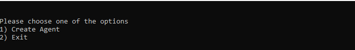
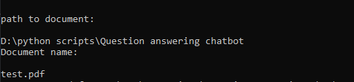

# Chat-bot

## How to execute this script

* Before starting the application go to resources.py file and mention your openAI api key in **os.environ["OPENAI_API_KEY"]**
* Run the script using "python main.py" from cmd
* Now we have to create a agent to get answer for our queries so select 1 
* After creating agent upload a path to file and filename for chatbot to understand context 
* If you see **"Ask your queries"** then chatbot is ready to answer all your questions
